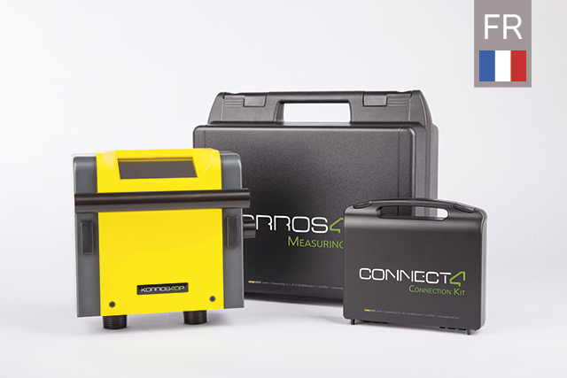

# **Korrostop4.0** - _Informations en langue française_

## Qu'est-ce que **Korrostop4.0**

_**Korrostop4.0**_ est un instrument fiable et précis de mesure de la conductivité, de la température et du débit de l'eau déionisée après un traitement avec le système _**E.KO IONISER**_. L'instrument de mesure [_**Korrostop4.0**_](https://www.easymetal.com/fr/produits/korrostop-40/korrostop-40.html) est conçu exclusivement pour être utilisé en combinaison avec un [_**E.KO IONISER**_](https://www.easymetal.com/fr/produits/eko-ioniser/domaine-dapplication.html). L'utilisation de _**Korrostop4.0**_ sur d'autres systèmes de déionisation n'est pas autorisée. Si _**Korrostop4.0**_ est utilisé illégalement en combinaison avec des produits tiers (systèmes de déionisation), des frais de licence seront facturés à titre de frais à compenser ultérieurement, qui ne sont couverts qu'en combinaison avec le _**E.KO IONISER 1501/1502/1503**_ .

Conçus à l'origine pour une utilisation industrielle pour le [traitement de l'eau lors du découpage par étincelles](https://www.easymetal.com/fr/solutions-specifiques/edm/utilisation-dans-le-domaine-edm.html), les _**E.KO IONISER**_ avec _**Korrostop4.0**_ sont utilisés de plus en plus fréquemment dans les autres domaines grâce à leur grande qualité.

La combinaison _**d'E.KO IONISER**_ avec _**Korrostop4.0**_ est compatible avec toutes les machines d'électroérosion (quel que soit le fabricant) et, grâce à ses nombreux canaux de communication, s'intègre parfaitement dans l'informatique d'entreprises existantes. _**Korrostop4.0**_ est l'appareil de mesure idéal pour perfectionner l'automatisation des processus dans votre entreprise. Voir également [**Fonctionnalités**](../../wiki/Toutes-les-fonctionnalités).

> La version actuelle **SYS412002** est sortie le 28/01/2020. Voir également [Versions](../../wiki/Versions).

## Vous trouverez ici :
* des [informationn](../../wiki) actualisées en permanence sur **Korrostop4.0**
* [Mises à jour](Mise-à-jour) pour le mécanisme de mise à jour par cartes SD
* [Spécifications](../../wiki) de **Korrostop4.0**
* [Outils et code source](IntegrationSamples) pour l'automatisation avec **Korrostop4.0**
* Pour les autres langues, voir également les [référentiels correspondants](https://github.com/easymetal?tab=repositories)

## Groupe cible de ces pages :
* **Prospects** : Information sur les fonctionnalités
* **Clients** : Consultation du manuel, des mises à jour, ...
* **[Revendeurs](https://www.easymetal.com/fr/distributeurs.html)** : Cas d'application et ouvrage de référence pour les demandes spécifiques des clients
* **Partenaires** : Cas d'application et spécifications
* **Développeurs** dans le domaine de l'automatisation des processus et de l'intégration : Exemples types et spécifications

> Image: **Korrostop4.0** sur **E.KO IONISER 1501** 

_© 2020 by [easymetal](https://www.easymetal.com/)_

## Liens Code QR :
* vers cette page  _(https://github.com/easymetal/Korrostop4.0-FR)_: **[Images/qrFR.png](Images/qrFR.png)**
* vers les pages Wiki  _(https://github.com/easymetal/Korrostop4.0-FR/wiki)_: **[Images/qrWiki.png](Images/qrWiki.png)**
* vers les pages GitHub d'easymetal  _(https://github.com/easymetal)_: **[Images/qrEasymetal.png](Images/qrEasymetal.png)**
* vers le site Web d'easymetal _(https://www.easymetal.com/)_: **[Images/qrWEB.png](Images/qrWEB.png)**
